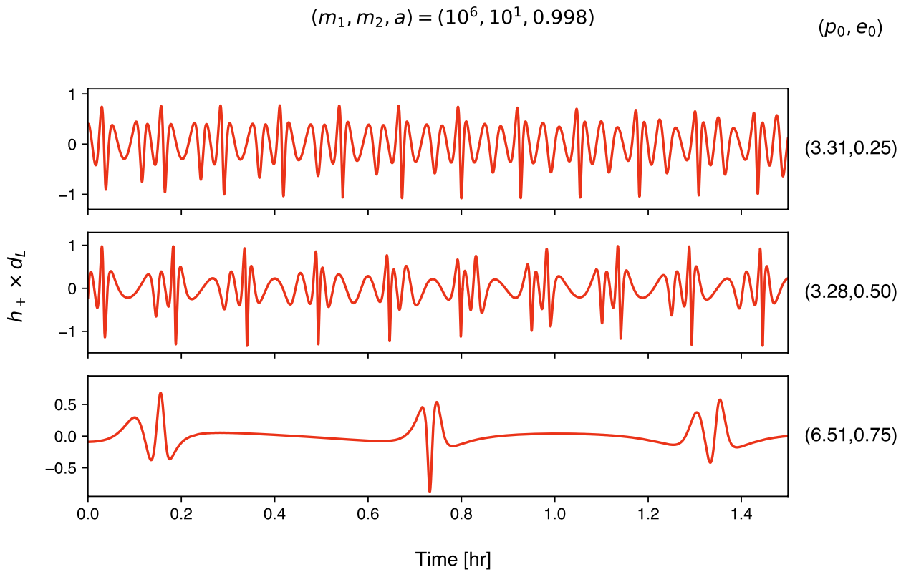



 <h1 style="display:inline">FastEMRIWaveforms</h1> <a href="https://github.com/BlackHolePerturbationToolkit/FastEMRIWaveforms" class="code_btn">Get the code!</a>

FastEMRIWaveforms is a Python package that generates "blazingly fast" and accurate EMRI waveforms with both CPU and GPU capabilities. There are pure Python modules as well as Python modules that wrap C/C++ and CUDA code. 

Unlike [kludge models](https://arxiv.org/abs/1705.04259) which make use of various weak field approximations the FEW model contains the full harmonic content of the EMRI waveform. The waveform generation time is typically 10s seconds on a CPU and < 1s on a GPU.
 
Currently, the package contains code to compute waveforms for eccentric, equatorial inspirals into a Kerr black hole, as well as the various separate modules used to create them. For the Kerr model the resulting waveforms faithfully match (slow to generate) reference waveforms with a worst case overlap of $\sim\times10^{-5}$ for inspirals with initial eccentricity $e_0 \le 0.85$. The figure below shows an example of the waveform from an inspiral into a Kerr black hole.

  Additionally, FastEMRIWaveforms provides a highly modular framework that allows users to build in custom modules particular to their research. In many cases, this makes it straightforward to add additional physics such as phasing corrections from environmental or beyond GR effects.

## Installation and documentation

All information and examples on installing and running the code can be found [in the FEW documentation](https://bhptoolkit.org/FastEMRIWaveforms/).

## Publications

Below we list the papers associated with the release of major updates of FEW. Additional papers that make use of FEW can be found in on the [BHPToolkit users page](https://bhptoolkit.org/users.html)

- v2.0.0 Kerr, equatorial model: [arXiv:2506.09470](https://arxiv.org/abs/2506.09470)
- v1.4.1 Frequency domain model: [arXiv:2307.12585](https://arxiv.org/abs/2307.12585)
- v1.0.0 Schwarzschild, equatorial model [arXiv:2008.06071](https://arxiv.org/abs/2008.06071), [arXiv:2104.04582](https://arxiv.org/abs/2104.04582)

## Authors and contributors

For a full list of people who have contributed to the development of FEW see the [CONTRIBUTORS.md](https://github.com/BlackHolePerturbationToolkit/FastEMRIWaveforms/blob/master/CONTRIBUTORS.md) file in the repository.