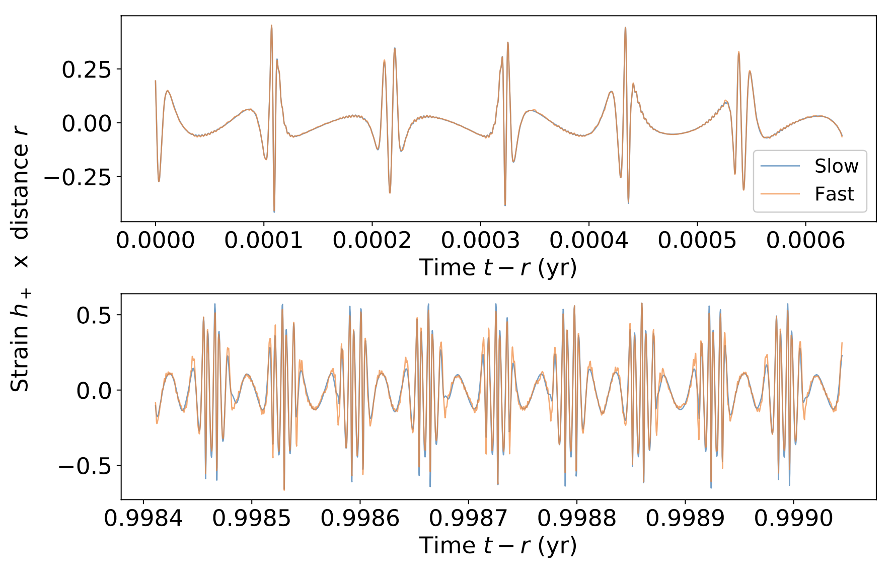



 <h1 style="display:inline">FastEMRIWaveforms</h1> <a href="https://github.com/BlackHolePerturbationToolkit/FastEMRIWaveforms" class="code_btn">Get the code!</a>

FastEMRIWaveforms is a Python package that generates "blazingly fast" and accurate EMRI waveforms with both CPU and GPU capabilities. There are pure Python modules as well as Python modules that wrap C/C++ and CUDA code. 

 Unlike [kludge models]() which make use of various weak field approximations the FEW model contains the full harmonic content of the EMRI waveform. The waveform generation time is typically 10s seconds on a CPU and < 1s on a GPU.
 
Currently, the package contains code to compute waveforms for eccentric inspiral into a Schwarzschild black hole, as well as the various separate modules used to create them. For the Schwarzschild model the resulting waveforms faithfully match (slow to generate) reference waveforms with a worst case overlap of $\le 5\times10^{-4}$ for inspirals with initial eccentricity $e_0 \le 0.7$. The below figure shows an example of the agreement between the FEW waveforms and the reference waveforms in the worst case.

  Additionally, FastEMRIWaveforms provides a highly modular framework that allows users to build in custom modules particular to their research. We expect to add models for inspirals in Kerr spacetime in the near future and it should be straight forward to add additional physics such as phasing corrections from environmental or beyond GR effects.

## Installation and documentation

All information and examples on installing and running the code can be found [in the FEW documentation](https://bhptoolkit.org/FastEMRIWaveforms/).

## Publications

The original FastEMRIWaveforms paper can be found at [arXiv:2008.06071](https://arxiv.org/abs/2008.06071).  
The first follow up paper can be found at [arXiv:2104.04582](https://arxiv.org/abs/2104.04582)

## Authors and contributors

**Michael Katz**, Alvin J. K. Chua, Niels Warburton