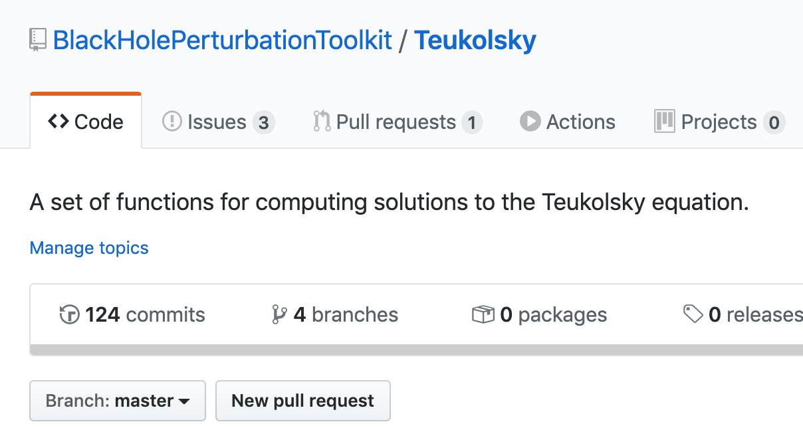
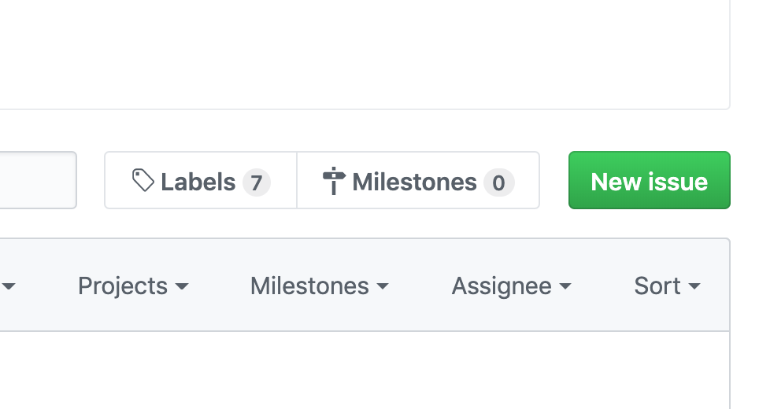
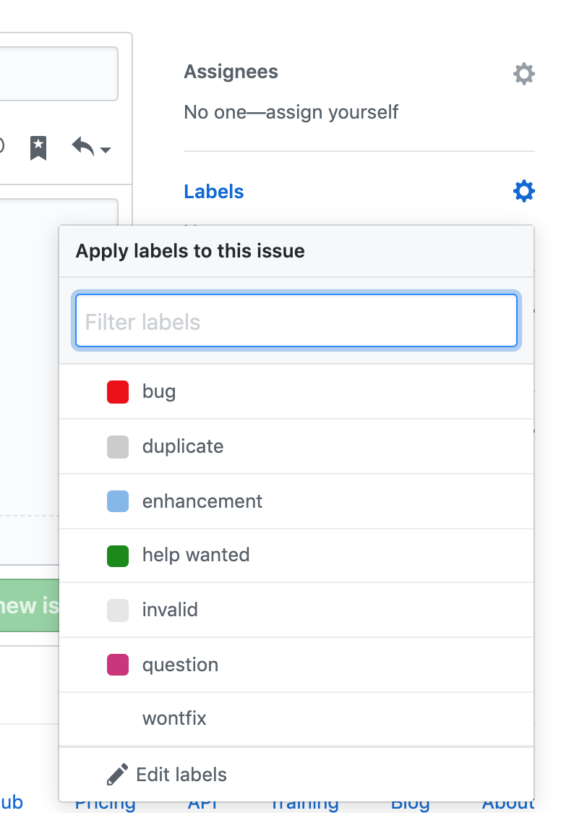

# How to use the issue trackers

Before submitting an issue we recommend you upgrade to the lastest version of the package in question as your issue might already have been resolved. If upgrading does not fix your issue, the instructions below tells you how to let us know about the issue.  

Each piece of the Toolkit has its own repository where the software or data is developed and stored (there is even a [repository for the Toolkit website](https://github.com/BlackHolePerturbationToolkit/blackholeperturbationtoolkit.github.io)). For most packages in the Toolkit this is can be accessed via the red "Get the code button" at the top right of each package description page. Clicking this button will bring you to the repository where you can view and download the code. At the top of this page you'll find a bunch of tabs that look like the image below.

Clicking the second "Issues" tab will bring you to the issue tracker. On this page you'll see a list of the current issues for the package. Before submitting a new issue you should check to see if the issue, or one very similar, has already been reported. If so, consider adding to the discussion around the issue. It can be useful for the developers know more information or simply which issues users are encountering most often. If your issue is not on the list click the green "New Issue" button on the right of the screen to report a new issue.

This will bring you to a new page where you can enter a description of the issue. If it is a software bug try to give a concrete example of where the software is failing, and if possible, what the correct result should be. The issue trackers are for more than just bugs. You can also submit enhancements your like to see, or even just genera questions you have about the Toolkit. On the right of the page you can label your issue to help the others know what sort of issue it is.

Once you are happy with your description of the issue and applied any labels you think are relevant click the green "Submit new issue button". This will post the issue and notify the developers who will reply in due course. Don't be afraid to submit issues on anything you find no matter how small.

