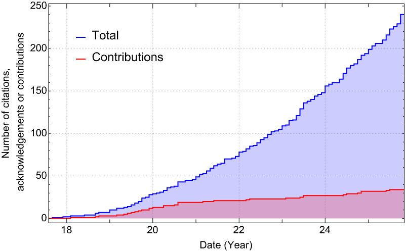

# Toolkit Contributors and Users

Building the Toolkit is a global, community effort and the fruits of that work are used even more widely. The below map shows the location of the developers, contributors and users of the Toolkit.

<iframe src="https://www.google.com/maps/d/u/0/embed?mid=1PZYkax3dpZ1Hx5b_MZ4qLl42AJIckGVt&z=2" width="840" height="580"></iframe>

The location of the lead institutions are shown in red, contributors are shown in blue and users in yellow. If you fall into any of these categories and are missing from the map let us know so we can add you.

## Papers that acknowledge, cite and/or extend the Toolkit

The graph below show the accumulated citations to the Toolkit over time. The blue curve shows the total citations and acknowledgements, the red curve tracks the total number of papers that have contributed software or data to the Toolkit.

Below is a list of research papers that have used or extended the Toolkit. Papers that have contributed code or data to the Toolkit have a (*) after them.

256\. "Decomposition of Schwarzschild Green's Function", Junquan Su, Neev Khera, Marc Casals, Sizheng Ma, Abhishek Chowdhuri, Huan Yang, [arXiv:2601.22015](https://arxiv.org/abs/2601.22015)

255\. "Spiral Density Waves and Torque Balance in the Kerr Geometry", Conor Dyson, Daniel J. D'Orazio, [arXiv:2601.19123](https://arxiv.org/abs/2601.19123)

254\. "Constants of motion in gravitational self-force theory", David Trestini, Zachary Nasipak, Adam Pound, [arXiv:2601.05223](https://arxiv.org/abs/2601.05223)

253\. "Quasinormal mode/grey-body factor correspondence for Kerr black holes", Zun-Xian Huang, Peng-Cheng Li, [arXiv:2512.23510](https://arxiv.org/abs/2512.23510)

252\. "The evaporation of near-extremal black holes through charged particle emission", Ilija Rakic, [arXiv:2512.18895](https://arxiv.org/abs/2512.18895)

251\. "Quasinormal modes of rotating black holes beyond general relativity in the WKB approximation", Ruijing Tang, Nicola Franchini, Sebastian H. Völkel, Emanuele Berti, [arXiv:2512.17786](https://arxiv.org/abs/2512.17786)

250\. "Inspiral-Transition-Plunge Gravitational Waveforms Beyond Kerr: A Kerr-Newman Case Study", Daiki Watarai, Kent Yagi, Shammi Tahura, [arXiv:2512.14156](https://arxiv.org/abs/2512.14156)

249\. "Quasinormal ringing of Kerr black holes. III. Excitation coefficients for equatorial inspirals from the innermost stable circular orbit", Matteo Della Rocca, Laura Pezzella, Emanuele Berti, Leonardo Gualtieri, Andrea Maselli, [arXiv:2512.07959](https://arxiv.org/abs/2512.07959)

248\. "Gravitational radiation from hyperbolic orbits: comparison between self-force, post-Minkowskian, post-Newtonian, and numerical relativity results", Niels Warburton, [arXiv:2512.02274](https://arxiv.org/abs/2512.02274)

247\. "Scattering of charged massive scalar waves by Kerr-Newman black holes", Qian Li, Qianchuan Wang, Junji Jia, [arXiv:2511.21318](https://arxiv.org/abs/2511.21318)

246\. "Constraint on massive vector field with extreme-mass-ratio inspirals around a slowly rotating black hole", Tieguang Zi, Peng-Cheng Li, Bao-Min Gu, Fu-Wen Shu, [arXiv:2511.18435](https://arxiv.org/abs/2511.18435)

245\. "The Physics of Black Holes and Their Environments: Consequences for Gravitational Wave Science", Vitor Cardoso, Shauvik Biswas, Subhodeep Sarkar, [arXiv:2511.14841](https://arxiv.org/abs/2511.14841)

244\. "Sub-Solar Mass Intermediate Mass Ratio Inspirals: Waveform Systematics and Detection Prospects with Gravitational Waves", Devesh Giri, Bhooshan Gadre, [arXiv:2511.13324](https://arxiv.org/abs/2511.13324)

243\. "Black-hole scattering with numerical relativity: Self-force extraction and post-Minkowskian validation", Oliver Long, Harald P. Pfeiffer, Lawrence E. Kidder, Mark A. Scheel, [arXiv:2511.10196](https://arxiv.org/abs/2511.10196)

242\. "Gravitational radiation from Kerr black holes using the Sasaki-Nakamura formalism: waveforms and fluxes at infinity", Yucheng Yin, Rico K. L. Lo, Xian Chen, [arXiv:2511.08673](https://arxiv.org/abs/2511.08673)

241\. "A-BHPT-toolkit: Analytic Black Hole Perturbation Theory Package for Gravitational Scattering Amplitudes", Jovan Markovic, Mikhail M. Ivanov, [arXiv:2511.04765](https://arxiv.org/abs/2511.04765)

240\. "Eccentric extreme-mass-ratio inspirals: a new window into ultra-light vector fields", Tieguang Zi, Fu-Wen Shu, [arXiv:2510.22275](https://arxiv.org/abs/2510.22275)

239\. "Ab uno disce omnes: Single-harmonic search for extreme mass-ratio inspirals", Lorenzo Speri, Rodrigo Tenorio, Christian Chapman-Bird, Davide Gerosa, [arXiv:2510.20891](https://arxiv.org/abs/2510.20891)

238\. "Hybrid waveform model for asymmetric spinning binaries: Self-force meets post-Newtonian theory", Loïc Honet, Adam Pound, Geoffrey Compère, [arXiv:2510.16114](https://arxiv.org/abs/2510.16114)

237\. "Post-adiabatic self-force waveforms: slowly spinning primary and precessing secondary", Josh Mathews, Barry Wardell, Adam Pound, Niels Warburton, [arXiv:2510.16113](https://arxiv.org/abs/2510.16113)

236\. "Spin-aligned inspiral waveforms from self-force and post-Newtonian theory", Loïc Honet, Josh Mathews, Geoffrey Compère, Adam Pound, Barry Wardell, Gabriel Andres Piovano, Maarten van de Meent, Niels Warburton, [arXiv:2510.16112](https://arxiv.org/abs/2510.16112)

235\. "Transition-to-plunge self-force waveforms with a spinning primary", Loïc Honet, Lorenzo Küchler, Adam Pound, Geoffrey Compère, [arXiv:2510.13958](https://arxiv.org/abs/2510.13958)

234\. "Black hole mergers beyond general relativity: a self-force approach", Ayush Roy, Lorenzo Küchler, Adam Pound, Rodrigo Panosso Macedo, [arXiv:2510.11793](https://arxiv.org/abs/2510.11793)

233\. "Hybridization of second-order gravitational self-force and numerical relativity waveforms for quasi-circular and non-spinning black hole binaries", Hector Iglesias, Leanne Durkan, Deirdre Shoemaker, [arXiv:2510.11685](https://arxiv.org/abs/2510.11685)

232\. "Particles with precessing spin in Kerr spacetime: analytic solutions for eccentric orbits and homoclinic motion near the equatorial plane", Gabriel Andres Piovano, [arXiv:2510.09597](https://arxiv.org/abs/2510.09597)

231\. "A relativistic treatment of accretion disk torques on extreme mass ratio inspirals around spinning black holes", Abhishek Hegade K.R., Charles F. Gammie, Nicolás Yunes, [arXiv:2510.03564](https://arxiv.org/abs/2510.03564)

230\. "Consistency of spin effects between numerical relativity and perturbation theory for inspiraling comparable-mass black hole binaries", Tousif Islam, Gaurav Khanna, Scott E. Field, [arXiv:2510.00531](https://arxiv.org/abs/2510.00531)

229\. "A relativistic treatment of accretion disk torques on extreme mass-ratio inspirals around non-spinning black holes", Abhishek Hegade K. R., Charles F. Gammie, Nicolás Yunes, [arXiv:2509.20457](https://arxiv.org/abs/2509.20457)

228\. "Systematic errors in fast relativistic waveforms for Extreme Mass Ratio Inspirals", Hassan Khalvati, Philip Lynch, Ollie Burke, Lorenzo Speri, Maarten van de Meent, Zachary Nasipak, [arXiv:2509.08875](https://arxiv.org/abs/2509.08875)

227\. "Resonance in black hole ringdown: Benchmarking quasinormal mode excitation and extraction", Kei-ichiro Kubota, Hayato Motohashi, [arXiv:2509.06411](https://arxiv.org/abs/2509.06411)

226\. "Prospects for EMRI/MBH parameter estimation using Quasi-Periodic Eruption timings: short-timescale analysis", Joheen Chakraborty, Lisa V. Drummond, Matteo Bonetti, Alessia Franchini, Shubham Kejriwal, Giovanni Miniutti, Riccardo Arcodia, Scott A. Hughes, Francisco Duque, Erin Kara, Alberto Sesana, Margherita Giustini, Amedeo Motta, Kevin Burdge, [arXiv:2508.20162](https://arxiv.org/abs/2508.20162)

225\. "Emergent Turbulence in Nonlinear Gravity", Sizheng Ma, Luis Lehner, Huan Yang, Lawrence E. Kidder, Harald P. Pfeiffer, Mark A. Scheel, [arXiv:2508.13294](https://arxiv.org/abs/2508.13294)

224\. "Effective source for second-order self-force calculations: quasicircular orbits in Schwarzschild spacetime", Samuel D. Upton, Barry Wardell, Adam Pound, Niels Warburton, Leor Barack, [arXiv:2508.00087](https://arxiv.org/abs/2508.00087)

223\. "Gravitational Wave Peep Contributions to Background Signal Confusion Noise for LISA", Daniel J Oliver, Aaron D Johnson, Lena Janssen, Joel Berrier, Kostas Glampedakis, Daniel Kennefick, [arXiv:2507.19704](https://arxiv.org/abs/2507.19704)

222\. "Towards relativistic inspirals into black holes surrounded by matter", Lukáš Polcar, Vojtěch Witzany, [arXiv:2507.15720](https://arxiv.org/abs/2507.15720)

221\. "A New High-Performing Method for Solving the Homogeneous Teukolsky Equation", Ye Jiang, Wen-Biao Han, [arXiv:2507.15363](https://arxiv.org/abs/2507.15363)

220\. "Post-adiabatic waveforms from extreme mass ratio inspirals in the presence of dark matter", Mostafizur Rahman, Takuya Takahashi, [arXiv:2507.06923](https://arxiv.org/abs/2507.06923)

219\. "Post-Newtonian expansion of fluxes from a scalar charge on an inclined-spherical orbit about a Kerr black hole", Jezreel C. Castillo, Charles R. Evans, Chris Kavanagh, Jakob Neef, Barry Wardell, Adrian Ottewill, [arXiv:2507.07303](https://arxiv.org/abs/2507.07303) (*)

218\. "Peaking into the abyss: Characterizing the merger of equatorial-eccentric-geodesic plunges in rotating black holes", Guglielmo Faggioli, Maarten van de Meent, Alessandra Buonanno, Gaurav Khanna, [arXiv:2507.05870](https://arxiv.org/abs/2507.05870)

217\. "Extreme mass-ratio inspiral within an ultralight scalar cloud I. Scalar radiation", Dongjun Li, Colin Weller, Patrick Bourg, Michael LaHaye, Nicolás Yunes, Huan Yang, [arXiv:2507.02045](https://arxiv.org/abs/2507.02045)

216\. "Spherical inspirals of spinning bodies into Kerr black holes", Viktor Skoupý, Gabriel Andres Piovano, Vojtěch Witzany, [arXiv:2506.20726](https://arxiv.org/abs/2506.20726)

215\. "Complete quasinormal modes of Type-D black holes", Changkai Chen, Jiliang Jing, Zhoujian Cao, Mengjie Wang, [arXiv:2506.14635](https://arxiv.org/abs/2506.14635)

214\. "Gravitational waves from b-EMRIs: Doppler shift and beaming, resonant excitation, helicity oscillations and self-lensing", João S. Santos, Vitor Cardoso, José Natário, Maarten van de Meent, [arXiv:2506.14868](https://arxiv.org/abs/2506.14868)

213\. "The Fast and the Frame-Dragging: Efficient waveforms for asymmetric-mass eccentric equatorial inspirals into rapidly-spinning black holes", Christian E. A. Chapman-Bird, Lorenzo Speri, Zachary Nasipak, Ollie Burke, Michael L. Katz, Alessandro Santini, Shubham Kejriwal, Philip Lynch, Josh Mathews, Hassan Khalvati, Jonathan E. Thompson, Soichiro Isoyama, Scott A. Hughes, Niels Warburton, Alvin J. K. Chua, Maxime Pigou, [arXiv:2506.09470](https://arxiv.org/abs/2506.09470) (*)

212\. "Quasinormal modes in Kerr spacetime as a 2D Eigenvalue problem", Jamil Assaad, Rodrigo Panosso Macedo, [arXiv:2506.04326](https://arxiv.org/abs/2506.04326)

211\. "Self-force framework for merger-ringdown waveforms", Lorenzo Küchler, Geoffrey Compère, Adam Pound [arXiv:2506.02189](https://arxiv.org/abs/2506.02189)

210\. "Black hole spectroscopy: from theory to experiment", Emanuele Berti et al. [arXiv:2505.23895](https://arxiv.org/abs/2505.23895)

209\. "Resonant DM scattering in the galactic center under the influence of EMRI", Takafumi Kakehi, Hidetoshi Omiya, Takuya Takahashi, Takahiro Tanaka, [arXiv:2505.10036](https://arxiv.org/abs/2505.10036)

208\. "Universal Waveforms for Extreme Mass-Ratio Inspiral", Ilan Strusberg, Barak Rom, Re'em Sari, [arXiv:2505.07941](https://arxiv.org/abs/2505.07941)

207\. "Extreme mass ratio inspirals in rotating dark matter spikes", Soumodeep Mitra, Nicholas Speeney, Sumanta Chakraborty, Emanuele Berti, [arXiv:2505.04697](https://arxiv.org/abs/2505.04697)

206\. "Korteweg-de Vries Integrals for Modified Black Hole Potentials: Instabilities and other Questions", Michele Lenzi, Arnau Montava Agudo, Carlos F. Sopuerta, [arXiv:2503.09918](https://arxiv.org/abs/2503.09918)

205\. "Superconvergent Discontinuous Galerkin Method for the Scalar Teukolsky Equation on Hyperboloidal Domains: Efficient Waveform and Self-Force Computation", Manas Vishal, Scott E. Field, Sigal Gottlieb, Jennifer Ryan, [arXiv:2503.11523](https://arxiv.org/abs/2503.11523)

204\. "Quadratic quasinormal modes at null infinity on a Schwarzschild spacetime", Patrick Bourg, Rodrigo Panosso Macedo, Andrew Spiers, Benjamin Leather, Bonga Béatrice, Adam Pound, [arXiv:2503.07432](https://arxiv.org/abs/2503.07432)

203\. "Signatures of Quantum Gravity in Gravitational Wave Memory", Nils Deppe, Lavinia Heisenberg, Lawrence E. Kidder, David Maibach, Sizheng Ma, Jordan Moxon, Kyle C. Nelli, William Throwe, Nils L. Vu, [arXiv:2502.20584](https://arxiv.org/abs/2502.20584)

202\. "Fundamental Physics and Cosmology with TianQin", Jun Luo et al. [arXiv:2502.20138](https://arxiv.org/abs/2502.20138)

201\. "Parametric solutions to the Kerr separatrix", Tammy Ng, Edward Teo, [arXiv:2502.18141](https://arxiv.org/abs/2502.18141)

200\. "Lensing and wave optics in the strong field of a black hole", Juno C. L. Chan, Conor Dyson, Matilde Garcia, Jaime Redondo-Yuste, Luka Vujeva, [arXiv:2502.14073](https://arxiv.org/abs/2502.14073)

199\. "Approach to the separatrix with eccentric orbits", Guillaume Lhost, Geoffrey Compère, [arXiv:2412.04249](https://arxiv.org/abs/2412.04249)

198\. "Quantum Criticality in Black Hole Scattering", Uri Kol, [arXiv:2411.09814](https://arxiv.org/abs/2411.09814)

197\. "Renormalized charged scalar current on a Reissner-Nordstrom black hole in the presence of charge superradiance", George Montagnon, Elizabeth Winstanley, [arXiv:2501.10780](https://arxiv.org/abs/2501.10780)

196\. "Quantum-Corrected Hawking Radiation from Near-Extremal Kerr-Newman Black Holes", Sabyasachi Maulik, Xin Meng, Leopoldo A. Pando Zayas, [arXiv:2501.08252](https://arxiv.org/abs/2501.08252)

195\. "Resumming Post-Minkowskian and Post-Newtonian gravitational waveform expansions", Andrea Cipriani, Giorgio Di Russo, Francesco Fucito, José Francisco Morales, Hasmik Poghosyan, Rubik Poghossian, [arXiv:2501.19257](https://arxiv.org/abs/2501.19257)

194\. "Environmental effects in extreme mass ratio inspirals: perturbations to the environment in Kerr", Conor Dyson, Thomas F.M. Spieksma, Richard Brito, Maarten van de Meent, Sam Dolan, [arXiv:2501.09806](https://arxiv.org/abs/2501.09806)

193\. "Monodromy eigenvalues of the radial Teukolsky equation and their connection to the renormalized angular momentum", Zachary Nasipak, [arXiv:2412.06503](https://arxiv.org/abs/2412.06503)

192\. "Post-adiabatic waveform-generation framework for asymmetric precessing binaries", Josh Mathews, Adam Pound, [arXiv:2501.01413](https://arxiv.org/abs/2501.01413)

191\. "Ringdown of a postinnermost stable circular orbit of a rapidly spinning black hole: Mass ratio dependence of higher harmonic quasinormal mode excitation", Daiki Watarai, [arXiv:2408.16747](https://arxiv.org/abs/2408.16747)

190\. "Analytic solution for the motion of spinning particles in Kerr space-time", Viktor Skoupý, Vojtěch Witzany, [arXiv:2411.16855](https://arxiv.org/abs/2411.16855)

189\. "Gravitational self-force with hyperboloidal slicing and spectral methods", Benjamin Leather, [arXiv:2411.14976](https://arxiv.org/abs/2411.14976)

188\. "Post-Newtonian expansion of energy and angular momentum fluxes: inclined spherical orbits about a Kerr black hole", Jezreel C. Castillo, Charles R. Evans, Chris Kavanagh, Jakob Neef, Adrian Ottewill, Barry Wardell, [arXiv:2411.09700](https://arxiv.org/abs/2411.09700) (*)

187\. "A note on the conversion of orbital angles for extreme mass ratio inspirals", Philip Lynch, Ollie Burke, [arXiv:2411.04955](https://arxiv.org/abs/2411.04955) (*)

186\. "Gravitational memory: new results from post-Newtonian and self-force theory", Kevin Cunningham, Chris Kavanagh, Adam Pound, David Trestini, Niels Warburton, Jakob Neef, [arXiv:2410.23950](https://arxiv.org/abs/2410.23950) (*)

185\. "Mode-sum prescription for renormalized expectation values for a charged quantum scalar field on a charged black hole", Cormac Breen, George Montagnon, Peter Taylor, Elizabeth Winstanley, [arXiv:2410.18211](https://arxiv.org/abs/2410.18211)

184\. "Impact of relativistic waveforms in LISA's science objectives with extreme-mass-ratio inspirals", Hassan Khalvati, Alessandro Santini, Francisco Duque, Lorenzo Speri, Jonathan Gair, Huan Yang, Richard Brito, [arXiv:2410.17310](https://arxiv.org/abs/2410.17310)

183\. "A test for LISA foreground Gaussianity and stationarity. II. Extreme mass-ratio inspirals", Manuel Piarulli, Riccardo Buscicchio, Federico Pozzoli, Ollie Burke, Matteo Bonetti, Alberto Sesana, [arXiv:2410.08862](https://arxiv.org/abs/2410.08862)

182\. "Spinning particles near Kerr black holes: Orbits and gravitational-wave fluxes through the Hamilton-Jacobi formalism", Gabriel Andres Piovano, Christiana Pantelidou, Jake Mac Uilliam, Vojtěch Witzany, [arXiv:2410.05769](https://arxiv.org/abs/2410.05769)

181\. "Gravitational Wave Astronomy With TianQin", En-Kun Li et al. [arXiv:2409.19665](https://arxiv.org/abs/2409.19665)

180\. "Floating orbits and energy extraction from magnetized Kerr black holes", João S. Santos, Vítor Cardoso, José Natário, [arXiv:2409.17225](https://arxiv.org/abs/2409.17225)

179\. "Spin wave optics for gravitational waves lensed by a Kerr black hole", Kei-ichiro Kubota, Shun Arai, Hayato Motohashi, Shinji Mukohyama, [arXiv:2408.03289](https://arxiv.org/abs/2408.03289)

178\. "Post-Newtonian observables for aligned-spin binaries to sixth order in spin from gravitational self-force and Compton amplitudes", Yilber Fabian Bautista, Mohammed Khalil, Matteo Sergola, Chris Kavanagh, Justin Vines, [arXiv:2408.01871](https://arxiv.org/abs/2408.01871)

177\. "Gravitational wave surrogate model for spinning, intermediate mass ratio binaries based on perturbation theory and numerical relativity", Katie Rink, Ritesh Bachhar, Tousif Islam, Nur E. M. Rifat, Kevin Gonzalez-Quesada, Scott E. Field, Gaurav Khanna, Scott A. Hughes, Vijay Varma, [arXiv:2407.18319](https://arxiv.org/abs/2407.18319)

176\. "Gravitational waves from black hole emission", Tousif Islam, Gaurav Khanna, Steven L. Liebling, [arXiv:2407.16989](https://arxiv.org/abs/2407.16989)

175\. "Phenomenology and origin of late-time tails in eccentric binary black hole mergers", Tousif Islam, Guglielmo Faggioli, Gaurav Khanna, Scott E. Field, Maarten van de Meent, Alessandra Buonanno, [arXiv:2407.04682](https://arxiv.org/abs/2407.04682)

174\. "Teukolsky equation for near-extremal black holes beyond general relativity: near-horizon analysis", Pablo A. Cano, Marina David, [arXiv:2407.02017](https://arxiv.org/abs/2407.02017)

173\. "Probing new fundamental fields with Extreme Mass Ratio Inspirals", Chao Zhang, Yungui Gong, [arXiv:2407.07449](https://arxiv.org/abs/2407.07449)

172\. "High-speed reconstruction of long-duration gravitational waves from extreme mass ratio inspirals using sparse dictionary learning", Charles Badger, José A. Font, Mairi Sakellariadou, Alejandro Torres-Forné, [arXiv:2407.02908](https://arxiv.org/abs/2407.02908)

171\. "Amplitudes and Polarizations of Quadratic Quasi-Normal Modes for a Schwarzschild Black Hole", Bruno Bucciotti, Leonardo Juliano, Adrien Kuntz, Enrico Trincherini, [arXiv:2406.14611](https://arxiv.org/abs/2406.14611)

170\. "Post-Newtonian expansions of extreme mass ratio inspirals of spinning bodies into Schwarzschild black holes", Viktor Skoupý, Vojtěch Witzany, [arXiv:2406.14291](https://arxiv.org/abs/2406.14291)

169\. "Sourced metric perturbations of Kerr spacetime in Lorenz gauge", Barry Wardell, Chris Kavanagh, Sam R. Dolan, [arXiv:2406.12510](https://arxiv.org/abs/2406.12510)

168\. "Testing eccentric corrections to the radiation-reaction force in the test-mass limit of effective-one-body models", Guglielmo Faggioli, Maarten van de Meent, Alessandra Buonanno, Aldo Gamboa, Mohammed Khalil, Gaurav Khanna, [arXiv:2405.19006](https://arxiv.org/abs/2405.19006)

167\. "Fast inspirals and the treatment of orbital resonances", Philip Lynch, Vojtěch Witzany, Maarten van de Meent, Niels Warburton, [arXiv:2405.21072](https://arxiv.org/abs/2405.21072)

166\. "Detecting the massive vector field with extreme mass-ratio inspirals", Tieguang Zi, Chao Zhang,  [arXiv:2406.11724](https://arxiv.org/abs/2406.11724)

165\. "Gravitational wave fluxes on generic orbits in near-extreme Kerr spacetime: higher spin and large eccentricity", Changkai Chen, Jiliang Jing, [arXiv:2311.15295](https://arxiv.org/abs/2311.15295)

164\. "Black hole scattering near the transition to plunge: Self-force and resummation of post-Minkowskian theory", Oliver Long, Christopher Whittall, Leor Barack, [arXiv:2406.08363](https://arxiv.org/abs/2406.08363)

163\. "Probing fundamental physics with Extreme Mass Ratio Inspirals: a full Bayesian inference for scalar charge", Lorenzo Speri, Susanna Barsanti, Andrea Maselli, Thomas P. Sotiriou, Niels Warburton, Maarten van de Meent, Alvin J. K. Chua, Ollie Burke, Jonathan Gair, [arXiv:2406.07607](https://arxiv.org/abs/2406.07607)

162\. "KerrGeoPy: A Python Package for Computing Timelike Geodesics in Kerr Spacetime", Seyong Park, Zachary Nasipak, [arXiv:2406.01413](https://arxiv.org/abs/2406.01413)

161\. "Backreaction from quantum fluxes at the Kerr inner horizon", Tyler McMaken, [arXiv:2405.13221](https://arxiv.org/abs/2405.13221)

160\. "Self-force framework for transition-to-plunge waveforms", Lorenzo Küchler, Geoffrey Compère, Leanne Durkan, Adam Pound, [arXiv:2405.00170](https://arxiv.org/abs/2405.00170)

159\. "Implementation of a GHZ-Teukolsky puncture scheme for gravitational self-force calculations", Patrick Bourg, Benjamin Leather, Marc Casals, Adam Pound, Barry Wardell, [arXiv:2403.12634](https://arxiv.org/abs/2403.12634)

158\. "Worldtube excision method for intermediate-mass-ratio inspirals: self-consistent evolution in a scalar-charge model", Nikolas A. Wittek, Adam Pound, Harald P. Pfeiffer, Leor Barack, [arXiv:2403.08864](https://arxiv.org/abs/2403.08864)

157\. "Hawking radiation inside a rotating black hole", Tyler McMaken, Andrew J. S. Hamilton, [arXiv:2401.03098](https://arxiv.org/abs/2401.03098)

156\. "Conserved currents for Kerr and orthogonality of quasinormal modes", Stephen R. Green, Stefan Hollands, Laura Sberna, Vahid Toomani, Peter Zimmerman, [arXiv:2210.15935](https://arxiv.org/abs/2210.15935)

155\. "Relativistic aerodynamics of spinning black holes", Conor Dyson, Jaime Redondo-Yuste, Maarten van de Meent, Vitor Cardoso, [arXiv:2402.07981](https://arxiv.org/abs/2402.07981)

154\. "A Survey of Four Precessing Waveform Models for Binary Black Hole Systems", Jake Mac Uilliam, Sarp Akcay, Jonathan E. Thompson, [arXiv:2402.06781](https://arxiv.org/abs/2402.06781)

153\. "The excitation of quadratic quasinormal modes for Kerr black holes", Sizheng Ma, Huan Yang, [arXiv:2401.15516](https://arxiv.org/abs/2401.15516)

152\. "Mapping between black-hole perturbation theory and numerical relativity II: gravitational-wave momentum", Tousif Islam, [arXiv:2401.14532](https://arxiv.org/abs/2401.14532)

151\. "Building a bridge between comparable and extreme mass ratio black hole binaries: a single spin precessing model for the final state", Maria de Lluc Planas, Joan Llobera-Querol, Sascha Husa, [arXiv:2401.13342](https://arxiv.org/abs/2401.13342)

150\. "Extreme mass-ratio inspirals as probes of scalar fields: inclined circular orbits around Kerr black holes", Matteo Della Rocca, Susanna Barsanti, Leonardo Gualtieri, Andrea Maselli, [arXiv:2401.09542](https://arxiv.org/abs/2401.09542)

149\. "DiscoTEX: Discontinuous collocation and implicit-turned-explicit (IMTEX) integration symplectic, symmetric numerical algorithms with higher order jumps for differential equations with numerical black hole perturbation theory applications", Lidia J. Gomes Da Silva, [arXiv:2401.08758](https://arxiv.org/abs/2401.08758)

148\. "Testing gravity with Extreme-Mass-Ratio Inspirals", Alejandro Cárdenas-Avendaño, Carlos F. Sopuerta, [arXiv:2401.08085](https://arxiv.org/abs/2401.08085)

147\. "Detecting dark matter with extreme mass-ratio inspirals", Chao Zhang, Guoyang Fu, Ning Dai, [arXiv:2401.04467](https://arxiv.org/abs/2401.04467)

146\. "Black Hole Perturbation Theory Meets CFT2: Kerr Compton Amplitudes from Nekrasov-Shatashvili Functions", Yilber Fabian Bautista, Giulio Bonelli, Cristoforo Iossa, Alessandro Tanzini, Zihan Zhou, [arXiv:2312.05965](https://arxiv.org/abs/2312.05965)

145\. "Ringdown of a dynamical spacetime", Jaime Redondo-Yuste, David Pereñiguez, Vitor Cardoso, [arXiv:2312.04633](https://arxiv.org/abs/2312.04633)

144\. "Waveform Modelling for the Laser Interferometer Space Antenna", LISA Consortium Waveform Working Group et al., [arXiv:2311.01300](https://arxiv.org/abs/2311.01300)

143\. "BHPWAVE: An adiabatic gravitational waveform model for compact objects undergoing quasi-circular inspirals into rotating massive black holes", Zachary Nasipak, [arXiv:2310.19706](https://arxiv.org/abs/2310.19706)

142\. "Accuracy Requirements: Assessing the Importance of First Post-Adiabatic Terms for Small-Mass-Ratio Binaries", Ollie Burke, Gabriel Andres Piovano, Niels Warburton, Phillip Lynch, Lorenzo Speri, Chris Kavanagh, Barry Wardell, Adam Pound, Leanne Durkan, Jeremy Miller, [arXiv:2310.08927](https://arxiv.org/abs/2310.08927)

141\. "Extreme mass-ratio inspiral and waveforms for a spinning body into a Kerr black hole via osculating geodesics and near-identity transformations", Lisa V. Drummond, Philip Lynch, Alexandra G. Hanselman, Devin R. Becker, Scott A. Hughes, [arXiv:2310.08438](https://arxiv.org/abs/2310.08438)

140\. "Mapping between black-hole perturbation theory and numerical relativity: gravitational-wave energy flux", Tousif Islam, [arXiv:2310.05743](https://arxiv.org/abs/2310.05743)

139\. "Impacts of Gravitational-Wave Background from Supermassive Black Hole Binaries on the Detection of Compact Binaries by LISA", Fan Huang, Yan-Chen Bi, Zhoujian Cao, Qing-Guo Huang, [arXiv:2309.14045](https://arxiv.org/abs/2309.14045)

138\. "Adiabatic inspirals under electromagnetic radiation reaction on Kerr spacetime", Ethan J German, Kevin Cunningham, Visakan Balakumar, Niels Warburton, Sam R Dolan, [arXiv:2309.10028](https://arxiv.org/abs/2309.10028)

137\. "Gravitational radiation from a particle plunging into a Schwarzschild black hole: frequency-domain and semi-relativistic analyses", Hector O. Silva, Giovanni Tambalo, Kostas Glampedakis, Kent Yagi, [arXiv:2308.14823](https://arxiv.org/abs/2308.14823)

136\. "Analytic solutions for the motion of spinning particles near spherically symmetric black holes and exotic compact objects", Vojtěch Witzany, Gabriel Andres Piovano, [arXiv:2308.00021](https://arxiv.org/abs/2308.00021)

135\. "Detection of astrophysical gravitational wave sources by TianQin and LISA", Alejandro Torres-Orjuela, Shun-Jia Huang, Zheng-Cheng Liang, Shuai Liu, Hai-Tian Wang, Chang-Qing Ye, Yi-Ming Hu, Jianwei Mei, [arXiv:2307.16628](https://arxiv.org/abs/2307.16628)

134\. "Extreme mass-ratio inspirals into black holes surrounded by scalar clouds", Richard Brito, Shreya Shah, [arXiv:2307.16093](https://arxiv.org/abs/2307.16093)

133\. "Fast and Fourier: Extreme Mass Ratio Inspiral Waveforms in the Frequency Domain", Lorenzo Speri, Michael L. Katz, Alvin J. K. Chua, Scott A. Hughes, Niels Warburton, Jonathan E. Thompson, Christian E. A. Chapman-Bird, Jonathan R. Gair, [arXiv:2307.12585](https://arxiv.org/abs/2307.12585) (*)

132\. "High-order post-Newtonian expansion of the generalized redshift invariant for eccentric-orbit, equatorial extreme-mass-ratio inspirals with a spinning primary", Christopher Munna, [arXiv:2307.11158](https://arxiv.org/abs/2307.11158) (*)

131\. "Quasinormal modes of rotating black holes in higher-derivative gravity", Pablo A. Cano, Kwinten Fransen, Thomas Hertog, Simon Maenaut, [arXiv:2307.07431](https://arxiv.org/abs/2307.07431)

130\. "Strongly-Lensed Extreme Mass-ratio Inspirals", Martina Toscani, Ollie Burke, Chang Liu, Nour Bou Zamel, Nicola Tamanini, Federico Pozzoli, [arXiv:2307.06722](https://arxiv.org/abs/2307.06722)

129\. "Towards exponentially-convergent simulations of extreme-mass-ratio inspirals: A time-domain solver for the scalar Teukolsky equation with singular source terms", Manas Vishal, Scott E. Field, Katherine Rink, Sigal Gottlieb, Gaurav Khanna, [arXiv:2307.01349](https://arxiv.org/abs/2307.01349)

128\. "Second-order perturbations of the Schwarzschild spacetime: practical, covariant and gauge-invariant formalisms", Andrew Spiers, Adam Pound, Barry Wardell, [arXiv:2306.17847](https://arxiv.org/abs/2306.17847) (*)

127\. "Applying the effective-source approach to frequency-domain self-force calculations for eccentric orbits", Benjamin Leather, Niels Warburton, [arXiv:2306.17221](https://arxiv.org/abs/2306.17221)

126\. "Recipes for computing radiation from a Kerr black hole using Generalized Sasaki-Nakamura formalism: I. Homogeneous solutions", Rico K. L. Lo, [arXiv:2306.16469](https://arxiv.org/abs/2306.16469)

125\. "Metric perturbations of Kerr spacetime in Lorenz gauge: Circular equatorial orbits", Sam R. Dolan, Leanne Durkan, Chris Kavanagh, Barry Wardell, [arXiv:2306.16459](https://arxiv.org/abs/2306.16459)

124\. "Importance of including higher signal harmonics in the modeling of extreme mass-ratio inspirals", Chao Zhang, Ning Dai, Dicong Liang, [arXiv:2306.13871](https://arxiv.org/abs/2306.13871)

123\. "Hyperboloidal discontinuous time-symmetric numerical algorithm with higher order jumps for gravitational self-force computations in the time domain", Lidia J. Gomes Da Silva, Rodrigo Panosso Macedo, Jonathan E. Thompson, Juan A. Valiente Kroon, Leanne Durkan, Oliver Long, [arXiv:2306.13153](https://arxiv.org/abs/2306.13153)

122\. "Tidal heating and torquing of the primary black hole in eccentric-orbit, non-spinning extreme-mass-ratio inspirals to 22PN order", Christopher Munna, Charles R. Evans, Erik Forseth, [arXiv:2306.12481](https://arxiv.org/abs/2306.12481) (*)

121\. "Gravitational waves from extreme mass ratio inspirals around a hairy Kerr black hole", Tieguang Zi, Peng-Cheng Li, [arXiv:2306.02683](https://arxiv.org/abs/2306.02683)

120\. "Self-forced inspirals with spin-orbit precession", Philip Lynch, Maarten van de Meent, Niels Warburton, [arXiv:2305.10533](https://arxiv.org/abs/2305.10533)

119\. "Frequency-domain approach to self-force in hyperbolic scattering", Christopher Whittall, Leor Barack, [arXiv:2305.09724](https://arxiv.org/abs/2305.09724)

118\. "Extreme mass-ratio inspiral of a spinning body into a Kerr black hole I: Evolution along generic trajectories", Lisa V. Drummond, Alexandra G. Hanselman, Devin R. Becker, Scott A. Hughes, [arXiv:2305.08919](https://arxiv.org/abs/2305.08919)

117\. "Gravitational Wave Peeps from EMRIs and their Implication for LISA Signal Confusion Noise", Daniel J Oliver, Aaron D Johnson, Joel Berrier, Kostas Glampedakis, Daniel Kennefick, [arXiv:2305.05793](https://arxiv.org/abs/2305.05793)

116\. "Detecting the secondary spin with extreme mass ratio inspirals in Scalar-Tensor theory", Hong Guo, Chao Zhang, Yunqi Liu, Rui-Hong Yue, Yungui Gong, Bin Wang, [arXiv:2305.00652](https://arxiv.org/abs/2305.00652)

115\. "Comparison of post-Minkowskian and self-force expansions: Scattering in a scalar charge toy model", Leor Barack, Zvi Bern, Enrico Herrmann, Oliver Long, Julio Parra-Martinez, Radu Roiban, Michael S. Ruf, Chia-Hsien Shen, Mikhail P. Solon, Fei Teng, Mao Zeng, [arXiv:2304.09200](https://arxiv.org/abs/2304.09200)

114\. "Enhancing the SEOBNRv5 effective-one-body waveform model with second-order gravitational self-force fluxes", Maarten van de Meent, Alessandra Buonanno, Deyan P. Mihaylov, Serguei Ossokine, Lorenzo Pompili, Niels Warburton, Adam Pound, Barry Wardell, Leanne Durkan, Jeremy Miller, [arXiv:2303.18026](https://arxiv.org/abs/2303.18026)

113\. "Asymptotic gravitational-wave fluxes from a spinning test body on generic orbits around a Kerr black hole", Viktor Skoupý, Georgios Lukes-Gerakopoulos, Lisa V. Drummond, Scott A. Hughes, [arXiv:2303.16798](https://arxiv.org/abs/2303.16798)

112\. "Lensing of Vacuum Entanglement near Schwarzschild Black Holes", João G. A. Caribé, Robert H. Jonsson, Marc Casals, Achim Kempf, Eduardo Martín-Martínez, [arXiv:2303.01402](https://arxiv.org/abs/2303.01402)

111\. "Black holes surrounded by generic dark matter profiles: appearance and gravitational-wave emission", Enzo Figueiredo, Andrea Maselli, Vitor Cardoso, [arXiv:2303.08183](https://arxiv.org/abs/2303.08183)

110\. "Kerr-fully Diving into the Abyss: Analytic Solutions to Plunging Geodesics in Kerr", Conor Dyson, Maarten van de Meent, [arXiv:2302.03704](https://arxiv.org/abs/2302.03704) (*)

109\. "Action-Angle formalism for extreme mass ratio inspirals in Kerr spacetime", Morteza Kerachian, Lukáš Polcar, Viktor Skoupý, Christos Efthymiopoulos, Georgios Lukes-Gerakopoulos, [arXiv:2301.08150](https://arxiv.org/abs/2301.08150)

108\. "Remnant black hole properties from numerical-relativity-informed perturbation theory and implications for waveform modelling", Tousif Islam, Scott E. Field, Gaurav Khanna, [arXiv:2301.07215](https://arxiv.org/abs/2301.07215)

107\. "Quasi-normal modes of non-separable perturbation equations: the scalar non-Kerr case", Rajes Ghosh, Nicola Franchini, Sebastian H. Völkel, Enrico Barausse, [arXiv:2303.00088](https://arxiv.org/abs/2303.00088)

106\. "Detecting vector charge with extreme mass ratio inspirals onto Kerr black holes", Chao Zhang, Hong Guo, Yungui Gong, Bin Wang, [arXiv:2301.05915](https://arxiv.org/abs/2301.05915)

105\. "Quasinormal Modes from Penrose Limits", Kwinten Fransen, [arXiv:2301.06999](https://arxiv.org/abs/2301.06999)

104\. "Rapid determination of LISA sensitivity to extreme mass ratio inspirals with machine learning", Christian E. A. Chapman-Bird, Christopher P. L. Berry, Graham Woan, [arXiv:2212.06166](https://arxiv.org/abs/2212.06166)

103\. "Gravitational wave from extreme mass-ratio inspirals as a probe of extra dimensions", Mostafizur Rahman, Shailesh Kumar, Arpan Bhattacharyya, [arXiv:2212.01404](https://arxiv.org/abs/2212.01404)

102\. "Expansions for semiclassical conformal blocks", Bruno Carneiro da Cunha, João Paulo Cavalcante, [arXiv:2211.03551](https://arxiv.org/abs/2211.03551)

101\. "Gravitational waves from eccentric extreme mass-ratio inspirals as probes of scalar fields", Chao Zhang, Yungui Gong, Dicong Liang, Bin Wang, [arXiv:2210.11121](https://arxiv.org/abs/2210.11121)

100\. "Gravitational waves from extreme-mass-ratio systems in astrophysical environments", Vitor Cardoso, Kyriakos Destounis, Francisco Duque, Rodrigo Panosso Macedo, Andrea Maselli, [arXiv:2210.01133](https://arxiv.org/abs/2210.01133)

99\. "Regularized Stable Kerr Black Hole: Cosmic Censorships, Shadow and Quasi-Normal Modes", Rajes Ghosh, Mostafizur Rahman, Akash K Mishra, [arXiv:2209.12291](https://arxiv.org/abs/2209.12291)

98\. "Self-force regularization of a point particle for generic orbits in Kerr spacetime: electromagnetic and gravitational cases", Anna Heffernan, [arXiv:2209.05450](https://arxiv.org/abs/2209.05450)

97\. "Self-force correction to the deflection angle in black-hole scattering: a scalar charge toy model", Leor Barack, Oliver Long, [arXiv:2209.03740](https://arxiv.org/abs/2209.03740)

96\. "Eccentric binary black holes: Comparing numerical relativity and small mass-ratio perturbation theory", Antoni Ramos-Buades, Maarten van de Meent, Harald P. Pfeiffer, Hannes R. Rüter, Mark A. Scheel, Michael Boyle, Lawrence E. Kidder, [arXiv:2209.03390](https://arxiv.org/abs/2209.03390)

95\. "Comparing second-order gravitational self-force and effective one body waveforms from inspiralling, quasi-circular and nonspinning black hole binaries II: the large-mass-ratio case", Angelica Albertini, Alessandro Nagar, Adam Pound, Niels Warburton, Barry Wardell, Leanne Durkan, Jeremy Miller, [arXiv:2208.02055](https://arxiv.org/abs/2208.02055)

94\. "Comparing second-order gravitational self-force, numerical relativity and effective one body waveforms from inspiralling, quasi-circular and nonspinning black hole binaries", Angelica Albertini, Alessandro Nagar, Adam Pound, Niels Warburton, Barry Wardell, Leanne Durkan, Jeremy Miller, [arXiv:2208.01049](https://arxiv.org/abs/2208.01049)

93\. "Collective filters: a new approach to analyze the gravitational-wave ringdown of binary black-hole mergers", Sizheng Ma, Keefe Mitman, Ling Sun, Nils Deppe, François Hébert, Lawrence E. Kidder, Jordan Moxon, William Throwe, Nils L. Vu, Yanbei Chen, [arXiv:2207.10870](https://arxiv.org/abs/2207.10870)

92\. "Measuring accretion-disk effects with gravitational waves from extreme mass ratio inspirals", Lorenzo Speri, Andrea Antonelli, Laura Sberna, Stanislav Babak, Enrico Barausse, Jonathan R. Gair, Michael L. Katz, [arXiv:2207.10086](https://arxiv.org/abs/2207.10086)

91\. "Extreme Love in the SPA: constraining the tidal deformability of supermassive objects with extreme mass ratio inspirals and semi-analytical, frequency-domain waveforms", Gabriel Andres Piovano, Andrea Maselli, Paolo Pani, [arXiv:2207.07452](https://arxiv.org/abs/2207.07452)

90\. "Post-geodesic corrections to the binding energy during the transition to plunge in numerical relativity simulations", Sergi Navarro Albalat, Aaron Zimmerman, Matthew Giesler, Mark A. Scheel, [arXiv:2207.04066](https://arxiv.org/abs/2207.04066)

89\. "Slow evolution of the metric perturbation due to a quasicircular inspiral into a Schwarzschild black hole", Leanne Durkan, Niels Warburton, [arXiv:2206.08179](https://arxiv.org/abs/2206.08179)

88\. "QuasinormalModes.jl: A Julia package for computing discrete eigenvalues of second order ODEs", Lucas Timotheo Sanches, [arXiv:2206.04747](https://arxiv.org/abs/2206.04747)

87\. "Post-Newtonian expansion of the spin-precession invariant for eccentric-orbit non-spinning extreme-mass-ratio inspirals to 9PN and e^16", Christopher Munna, Charles R. Evans, [arXiv:2206.04085](https://arxiv.org/abs/2206.04085) (*)

86\. "Modeling transient resonances in extreme-mass-ratio inspirals", Priti Gupta, Lorenzo Speri, Béatrice Bonga, Alvin J.K. Chua, Takahiro Tanaka, [arXiv:2205.04808](https://arxiv.org/abs/2205.04808)

85\. "The impact of relativistic corrections on the detectability of dark-matter spikes with gravitational waves", Nicholas Speeney, Andrea Antonelli, Vishal Baibhav, Emanuele Berti, [arXiv:2204.12508](https://arxiv.org/abs/2204.12508)

84\. "Detecting electric charge with Extreme Mass Ratio Inspirals", Chao Zhang, Yungui Gong, [arXiv:2204.01972](https://arxiv.org/abs/2204.08881)

83\. "Surrogate model for gravitational wave signals from non-spinning, comparable- to large-mass-ratio black hole binaries built on black hole perturbation theory waveforms calibrated to numerical relativity", Tousif Islam, Scott E. Field, Scott A. Hughes, Gaurav Khanna, Vijay Varma, Matthew Giesler, Mark A. Scheel, Lawrence E. Kidder, Harald P. Pfeiffer, [arXiv:2204.01972](https://arxiv.org/abs/2204.01972) (*)

82\. "High-order post-Newtonian expansion of the redshift invariant for eccentric-orbit non-spinning extreme-mass-ratio inspirals", Christopher Munna, Charles R. Evans, [arXiv:2203.13832](https://arxiv.org/abs/2203.13832)

81\. "Extreme mass-ratio inspirals as probes of scalar fields: eccentric equatorial orbits around Kerr black holes", Susanna Barsanti, Nicola Franchini, Leonardo Gualtieri, Andrea Maselli, Thomas P. Sotiriou, [arXiv:2203.05003](https://arxiv.org/abs/2203.05003)

80\. "Redshift factor and the small mass-ratio limit in binary black hole simulations", Sergi Navarro Albalat, Aaron Zimmerman, Matthew Giesler, Mark A. Scheel, [arXiv:2203.04893](https://arxiv.org/abs/2203.04893)

79\. "Hyperboloidal method for frequency-domain self-force calculations", Rodrigo Panosso Macedo, Benjamin Leather, Niels Warburton, Barry Wardell, Anıl Zenginoğlu, [arXiv:2202.01794](https://arxiv.org/abs/2202.01794)

78\. "Precisely computing bound orbits of spinning bodies around black holes II: Generic orbits", Lisa V. Drummond, Scott A. Hughes, [arXiv:2201.13335](https://arxiv.org/abs/2201.13335)

77\. "Precisely computing bound orbits of spinning bodies around black holes I: General framework and results for nearly equatorial orbits", Lisa V. Drummond, Scott A. Hughes, [arXiv:2201.13334](https://arxiv.org/abs/2201.13334)

76\. "Detection of scalar fields by Extreme Mass Ratio Inspirals with a Kerr black hole", Hong Guo, Yunqi Liu, Chao Zhang, Yungui Gong, Wei-Liang Qian, Rui-Hong Yue, [arXiv:2201.10748](https://arxiv.org/abs/2201.10748)

75\. "Adiabatic equatorial inspirals of a spinning body into a Kerr black hole", Viktor Skoupý, Georgios Lukes-Gerakopoulos, [arXiv:2201.07044](https://arxiv.org/abs/2201.07044)

74\. "On Detecting Equatorial Symmetry Breaking with LISA", Kwinten Fransen, Daniel R. Mayerson, [arXiv:2201.03569](https://arxiv.org/abs/2201.03569)

73\. "The prospect of distinguishing astrophysical objects with LISA", Mostafizur Rahman, Arpan Bhattacharyya, [arXiv:2112.13869](https://arxiv.org/abs/2112.13869)

72\. "Gravitational waveforms for compact binaries from second-order self-force theory", Barry Wardell, Adam Pound, Niels Warburton, Jeremy Miller, Leanne Durkan, Alexandre Le Tiec, [arXiv:2112.12265](https://arxiv.org/abs/2112.12265)

71\. "Adiabatic waveforms from extreme-mass-ratio inspirals: an analytical approach", Soichiro Isoyama, Ryuichi Fujita, Alvin J. K. Chua, Hiroyuki Nakano, Adam Pound, Norichika Sago, [arXiv:2111.05288](https://arxiv.org/abs/2111.05288)

70\. "Deformed Schwarzschild horizons in second-order perturbation theory: mass, geometry, and teleology", Riccardo Bonetto, Adam Pound, Zeyd Sam, [arXiv:2109.09514](https://arxiv.org/abs/2109.09514)

69\. "The Radial Action from Probe Amplitudes to All Orders", Uri Kol, Donal O'connell, Ofri Telem, [arXiv:2109.12092](https://arxiv.org/abs/2109.12092)

68\. "Detecting Subsolar-Mass Primordial Black Holes in Extreme Mass-Ratio Inspirals with LISA and Einstein Telescope", Susanna Barsanti, Valerio De Luca, Andrea Maselli, Paolo Pani, [arXiv:2109.02170](https://arxiv.org/abs/2109.02170)

67\. "Survey of gravitational wave memory in intermediate mass ratio binaries", Tousif Islam, Scott E. Field, Gaurav Khanna, Niels Warburton, [arXiv:2109.00754](https://arxiv.org/abs/2109.00754)

66\. "Highly eccentric EMRI waveforms via fast self-forced inspirals", Jonathan McCart, Thomas Osburn, Justin Y. J. Burton, [arXiv:2109.00056](https://arxiv.org/abs/2109.00056)

65\. "Tests for the existence of horizon through gravitational waves from a small binary in the vicinity of a massive object", Yun Fang, Rong-Zhen Guo, Qing-Guo Huang, [arXiv:2108.04511](https://arxiv.org/abs/2108.04511)

64\. Regularization of a scalar charged particle for generic orbits in Kerr spacetime, Anna Heffernan, [arXiv:2107.14750](https://arxiv.org/abs/2107.14750) (*)

63\. Gravitational-wave energy flux for compact binaries through second order in the mass ratio, Niels Warburton, Adam Pound, Barry Wardell, Jeremy Miller, Leanne Durkan, [arXiv:2107.01298](https://arxiv.org/abs/2107.01298)

62\. Detecting new fundamental fields with LISA, Andrea Maselli, Nicola Franchini, Leonardo Gualtieri, Thomas P. Sotiriou, Susanna Barsanti, Paolo Pani, [arXiv:2106.11325](https://arxiv.org/abs/2106.11325)

61\. Divergences in gravitational-wave emission and absorption from extreme mass ratio binaries, Enrico Barausse, Emanuele Berti, Vitor Cardoso, Scott A. Hughes, Gaurav Khanna, [arXiv:2106.09721](https://arxiv.org/abs/2106.09721)

60\. Classification of radial Kerr geodesic motion, Geoffrey Compère, Yan Liu, Jiang Long, [arXiv:2106.03141](https://arxiv.org/abs/2106.03141)

59\. Resonant self-force effects in extreme-mass-ratio binaries: A scalar model, Zachary Nasipak, Charles R. Evans, [arXiv:2105.15188](https://arxiv.org/abs/2105.15188)

58\. Assessing the detectability of the secondary spin in extreme mass-ratio inspirals with fully-relativistic numerical waveforms, Gabriel Andres Piovano, Richard Brito, Andrea Maselli, Paolo Pani, [arXiv:2105.07083](https://arxiv.org/abs/2105.07083)

57\. Time-domain metric reconstruction for hyperbolic scattering, Oliver Long, Leor Barack, [arXiv:2105.05630](https://arxiv.org/abs/2105.05630)

56\. Black-Hole Perturbation Plus Post-Newtonian Theory: Hybrid Waveform for Neutron Star Binaries, Xuefeng Feng, Zhenwei Lyu, Huan Yang, [arXiv:2104.11848](https://arxiv.org/abs/2104.11848)

55\. FastEMRIWaveforms: New tools for millihertz gravitational-wave data analysis, Michael L. Katz, Alvin J.K. Chua, Lorenzo Speri, Niels Warburton, Scott A. Hughes, [arXiv:2104.04582](https://arxiv.org/abs/2104.04582) (*)

54\. Importance of tidal resonances in extreme-mass-ratio inspirals, Priti Gupta, Béatrice Bonga, Alvin J. K. Chua, Takahiro Tanaka, [arXiv:2104.03422](https://arxiv.org/abs/2104.03422)

53\. Assessing the impact of transient orbital resonances, Lorenzo Speri, Jonathan R. Gair, [arXiv:2103.06306](https://arxiv.org/abs/2103.06306)

52\. Stellar transits across a magnetized accretion torus as a mechanism for plasmoid ejection, Petra Suková, Michal Zajaček, Vojtěch Witzany, Vladimír Karas, [arXiv:2102.08135](https://arxiv.org/abs/2102.08135)

51\. The Teukolsky-Starobinsky constants: facts and fictions, Rita Teixeira da Costa, Marc Casals, [arXiv:2102.06734](https://arxiv.org/abs/2102.06734)

50\. "Spinning test body orbiting around a Kerr black hole: eccentric equatorial orbits and their asymptotic gravitational-wave fluxes", Viktor Skoupý, Georgios Lukes-Gerakopoulos, [arXiv:2102.04819](https://arxiv.org/abs/2102.04819)

49\. "Scope out multiband gravitational-wave observations of GW190521-like binary black holes with space gravitational wave antenna B-DECIGO", Hiroyuki Nakano, Ryuichi Fujita, Soichiro Isoyama, Norichika Sago, [arXiv:2101.06402](https://arxiv.org/abs/2101.06402)

48\. "Black hole perturbation theory and gravitational self-force", Adam Pound, Barry Wardell, [arXiv:2101.04592](https://arxiv.org/abs/2101.04592)

47\. "Gravitational wave templates from Extreme Mass Ratio Inspirals", Viktor Skoupý,  Georgios Lukes-Gerakopoulos, [arXiv:2101.04533](https://arxiv.org/abs/2101.04533)

46\. "Post-Newtonian templates for gravitational waves from compact binary inspirals", Soichiro Isoyama, Riccardo Sturani, Hiroyuki Nakano, [arXiv:2012.01350](https://arxiv.org/abs/2012.01350)

45\. "Characteristic formulation of the Regge-Wheeler and Zerilli Green functions", Conor O'Toole, Adrian Ottewill, Barry Wardell, [arXiv:2010.15818](https://arxiv.org/abs/2010.15818)

44\. "Extreme precision for extreme spin: probing near-extremal black holes using LISA", Ollie Burke, Jonathan R. Gair, Joan Simón, Matthew C. Edwards, [arXiv:2010.05932](https://arxiv.org/abs/2010.05932)

43\. "Extreme mass ratio inspirals on the equatorial plane in the adiabatic order", Ryuichi Fujita, Masaru Shibata, [arXiv:2008.13554](https://arxiv.org/abs/2008.13554)

42\. "Electromagnetic self-force on a charged particle on Kerr spacetime: equatorial circular orbits", T. Torres, S. R. Dolan, [arXiv:2008.12703](https://arxiv.org/abs/2008.12703) (*)

41\. "Augmented analytic kludge waveform with quadrupole moment correction", Miaoxin Liu, Jian-dong Zhang, [arXiv:2008.11396](https://arxiv.org/abs/2008.11396)

40\. "Analytic post-Newtonian expansion of the energy and angular momentum radiated to infinity by eccentric-orbit non-spinning extreme-mass-ratio inspirals to 19PN", Christopher Munna, [arXiv:2008.10622](https://arxiv.org/abs/2008.10622) (*)

39\. "Rapid generation of fully relativistic extreme-mass-ratio-inspiral waveform templates for LISA data analysis", Alvin J. K. Chua, Michael L. Katz, Niels Warburton, Scott A. Hughes, [arXiv:2008.06071](https://arxiv.org/abs/2008.06071) (*)

38\. "An alternative to the Teukolsky equation", Yasuyuki Hatsuda, [arXiv:2007.07906](https://arxiv.org/abs/2007.07906)

37\. "Intermediate mass-ratio black hole binaries: Applicability of small mass-ratio perturbation theory", Maarten van de Meent, Harald P. Pfeiffer, [arXiv:2006.12036](https://arxiv.org/abs/2006.12036)

36\. "Modeling and detecting resonant tides of exotic compact objects", Kwinten Fransen, Gideon Koekoek, Rob Tielemans, Bert Vercnocke, [arXiv:2005.12286](https://arxiv.org/abs/2005.12286), 

35\. "Ringing of rotating black holes in higher-derivative gravity", Pablo A. Cano, Kwinten Fransen, Thomas Hertog, [arXiv:2005.03671](https://arxiv.org/abs/2005.03671)

34\. "Determination of new coefficients in the angular momentum and energy fluxes at infinity to 9PN for eccentric Schwarzschild extreme-mass-ratio inspirals using mode-by-mode fitting", Christopher Munna, Charles R. Evans, Seth Hopper, Erik Forseth, [arXiv:2005.03044](https://arxiv.org/abs/2005.03044) (*)  

33\. "Pseudospectrum and black hole quasi-normal mode (in)stability", José Luis Jaramillo, Rodrigo Panosso Macedo, Lamis Al Sheikh, [arXiv:2004.06434](https://arxiv.org/abs/2004.06434)

32\. "Extreme mass ratio inspirals with spinning secondary: a detailed study of equatorial circular motion", Gabriel Andres Piovano, Andrea Maselli, Paolo Pani1, [arXiv:2004.02654](https://arxiv.org/abs/2004.02654) (*)

31\. "Model independent tests of the Kerr bound with extreme mass ratio inspirals", Gabriel Andres Piovano, Andrea Maselli, Paolo Pani, [arXiv:2003.08448](https://arxiv.org/abs/2003.08448)

30\. "Redshift-space streaming velocity effects on the Lyman-α forest baryon acoustic oscillation scale", Jahmour J. Givans, Christopher M. Hirata, [arXiv:2002.12296](https://arxiv.org/abs/2002.12296)  

29\. "Near-horizon geodesics of high-spin black holes", Geoffrey Compère, Adrien Druart, [arXiv:2001.03478](https://arxiv.org/abs/2001.03478) (*)

28\. "Dissipation in extreme-mass ratio binaries with a spinning secondary", Sarp Akcay, Sam R. Dolan, Chris Kavanagh, Jordan Moxon, Niels Warburton, Barry Wardell, [arXiv:1912.09461](https://arxiv.org/abs/1912.09461) (*)

27\. "The location of the last stable orbit in Kerr spacetime", Leo C. Stein, Niels Warburton, [arXiv:1912.07609](https://arxiv.org/abs/1912.07609) (*)

26\. "A Surrogate Model for Gravitational Wave Signals from Comparable- to Large- Mass-Ratio Black Hole Binaries", Nur E. M. Rifat, Scott E. Field, Gaurav Khanna, Vijay Varma, [arXiv:1910.10473](https://arxiv.org/abs/1910.10473) (*)

25\. "Spicing up the recipe for echoes from exotic compact objects: orbital differences and corrections in rotating backgrounds", Luís Felipe Longo Micchi, Cecilia Chirenti, [arXiv:1912.05419](https://arxiv.org/abs/1912.05419)

24\. "Gravitational wave signatures of ultralight vector bosons from black hole superradiance", Nils Siemonsen, William E. East, [Phys. Rev. D 101, 024019 (2020)](https://doi.org/10.1103/PhysRevD.101.024019),  [arXiv:1910.09476](https://arxiv.org/abs/1910.09476v2)

23\. "Tidal heating as a discriminator for horizons in extreme mass ratio inspirals", Sayak Datta, Richard Brito, Sukanta Bose, Paolo Pani, Scott A. Hughes, [arXiv:1910.07841](https://arxiv.org/abs/1910.07841)

22\. "Gravitational Wave Perturbations on a Kerr Background and Applications for Echoes", Randy S. Conklin, [arXiv:1911.07122](https://arxiv.org/abs/1911.07122)

21\. "Regularized calculation of the retarded Green function in Schwarzschild spacetime", Marc Casals, Brien C. Nolan, Adrian C. Ottewill, Barry Wardell, [Phys. Rev. D 100, 104037 (2019)](https://doi.org/10.1103/PhysRevD.100.104037),  [arXiv:1910.02567](https://arxiv.org/abs/1910.02567)

20\. "Transition from Inspiral to Plunge: A Complete Near-Extremal Waveform", Ollie Burke, Jonathan R. Gair, Joan Simón, [arXiv:1909.12846](https://arxiv.org/abs/1909.12846)

19\. "Eccentric-orbit EMRI radiation: Analytic forms of leading-logarithm and subleading-logarithm flux terms at high PN orders", Christopher Munna, Charles R. Evans, [arXiv:1909.05877](https://arxiv.org/abs/1909.05877) (*)  

18\. "Unveiling the Gravitational Universe at μ-Hz Frequencies", Alberto Sesana et al. [arXiv:1908.11391](https://arxiv.org/abs/1908.11391)

17\. "qnm: A Python package for calculating Kerr quasinormal modes, separation constants, and spherical-spheroidal mixing coefficients", Leo C. Stein, [J. Open Source Softw., 4(42), 1683 (2019)](https://doi.org/10.21105/joss.01683) [arXiv:1908.10377](https://arxiv.org/abs/1908.10377) (*)

16\. "Factorization and resummation: A new paradigm to improve gravitational wave amplitudes. III: the spinning test-body terms", Alessandro Nagar, Francesco Messina, Chris Kavanagh, Georgios Lukes-Gerakopoulos, Niels Warburton, Sebastiano Bernuzzi, Enno Harms, [Phys. Rev. D 100, 104056 (2019)](https://doi.org/10.1103/PhysRevD.100.104056), [arXiv:1907.12233](https://arxiv.org/abs/1907.12233) (*)

15\. "Quasi-circular inspirals and plunges from non-spinning effective-one-body Hamiltonians with gravitational self-force information", Andrea Antonelli, Maarten van de Meent, Alessandra Buonanno, Jan Steinhoff, Justin Vines, [arXiv:1907.11597](https://arxiv.org/abs/1907.11597)

14\. "Analytic solutions for parallel transport along generic bound geodesics in Kerr spacetime", M. van de Meent, [arXiv:1906.05090](https://arxiv.org/abs/1906.05090) (*)

13\. "Repeated faint quasinormal bursts in EMRI waveforms: evidence from frequency-domain scalar self-force calculations on generic Kerr orbits", Zach Nasipak, Thomas Osburn, Charles R. Evans, [Phys. Rev. D 100, 064008 (2019)](https://doi.org/10.1103/PhysRevD.100.064008), [arXiv:1905.13237](https://arxiv.org/abs/1905.13237) (*)

12\. "Hamilton-Jacobi equation for spinning particles near black holes", Vojtěch Witzany, [Phys. Rev. D 100, 104030 (2019)](https://doi.org10.1103/PhysRevD.100.104030), [arXiv:1903.03651](https://arxiv.org/abs/1903.03651)

11\. "Gravitational waves from bodies orbiting the Galactic Center black hole and their detectability by LISA", Eric Gourgoulhon, Alexandre Le Tiec, Frederic H. Vincent, Niels Warburton, [A&A, 627 (2019) A92](https://doi.org/10.1051/0004-6361/201935406), [arXiv:1903.02049](https://arxiv.org/abs/1903.02049) (*)

10\. "Exciting black hole modes via misaligned coalescences: I. Inspiral, transition, and plunge trajectories using a generalized Ori-Thorne procedure", Anuj Apte, Scott A. Hughes, [Phys. Rev. D 100, 084031 (2019)](https://doi.org/10.1103/PhysRevD.100.084031),  [arXiv:1901.05901](https://arxiv.org/abs/1901.05901)

9\. "Spin and Quadrupole Couplings for High Spin Equatorial Intermediate Mass-ratio Coalescences", Bin Chen, Geoffrey Compère, Yan Liu, Jiang Long, Xuao Zhang, [arXiv:1901.05370](https://arxiv.org/abs/1901.05370)

8\. "Spectroscopy of Extremal (and Near-Extremal) Kerr Black Holes", M. Casals, Luís F. Longo Micchi, [Phys. Rev. D 99, 084047 (2019)](https://doi.org/10.1103/PhysRevD.99.084047),  [arXiv:1901.04586](https://arxiv.org/abs/1901.04586)

7\. "High-order asymptotics for the Spin-Weighted Spheroidal Equation at large real frequency", M. Casals, A. C. Ottewill, N. Warburton, [Proc. R. Soc. A 475:20180701 (2019)](https://doi.org/10.1098/rspa.2018.0701), [arXiv:1810.00432](https://arxiv.org/abs/1810.00432) (*)

6\. ""Flux-balance formulae" for extreme mass-ratio inspirals", Soichiro Isoyama, Ryuichi Fujita, Hiroyuki Nakano, Norichika Sago, Takahiro Tanaka, [Prog. Theor. Exp. Phys. (2019) 013E01](https://doi.org/10.1093/ptep/pty136), [arXiv:1809.11118](https://arxiv.org/abs/1809.11118)

5\. "Gravitational self-force corrections to gyroscope precession along circular orbits in the Kerr spacetime", D. Bini, T. Damour, A. Geralico, C. Kavanagh, M. van de Meent, [Phys. Rev. D 98, 104062 (2018)](https://doi.org/10.1103/PhysRevD.98.104062), [arXiv:1809.02516](https://arxiv.org/abs/1809.02516) (*)

4\. "Black holes, gravitational waves and fundamental physics: a roadmap", Leor Barack et al., [Class. Quant. Grav. 36:14](https://doi.org/10.1088/1361-6382/ab0587) [arXiv:1806.05195](https://arxiv.org/abs/1806.05195)

3\. "Fast Self-Forced Inspirals", M. van de Meent, N. Warburton, [Class. Quant. Grav. 35:144003](https://doi.org/10.1088/1361-6382/aac8ce), [arXiv:1802.05281](https://arxiv.org/abs/1802.05281) (*)

2\. "Gravitational waves from plunges into Gargantua", Geoffrey Compère, Kwinten Fransen, Thomas Hertog, Jiang Long, [Class. Quant.Grav. 35 (2018) no.10, 104002](http://iopscience.iop.org/article/10.1088/1361-6382/aab99e/meta), [arXiv:1712.07130](https://arxiv.org/abs/1712.07130)

1\. "Quantum correlator outside a Schwarzschild black hole", Cláudia Buss, Marc Casals, [Phys. Lett. B 776, p168-173 (2017)](https://doi.org/10.1016/j.physletb.2017.11.048), [arXiv:1709.05990](https://arxiv.org/abs/1709.05990)

If you have a work that makes use of the Toolkit and would like it listed here please let us know.
